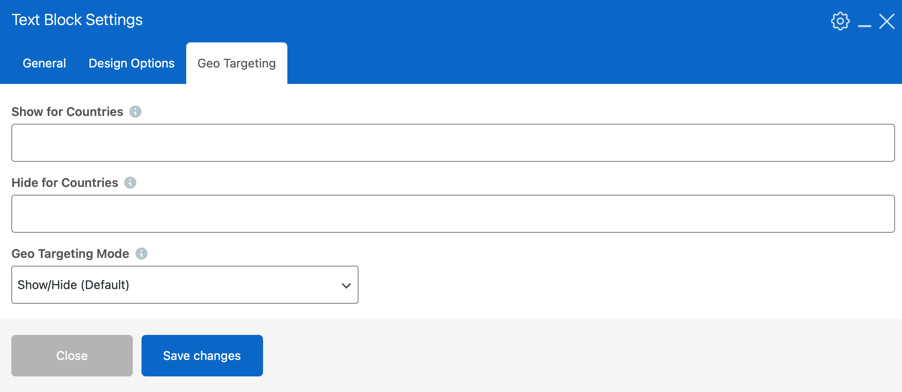
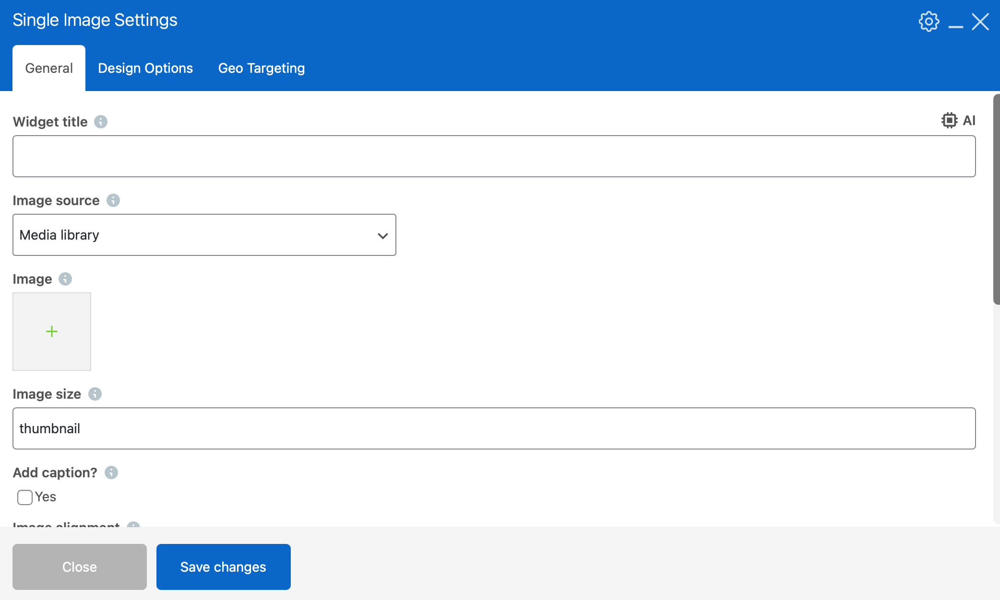

# WPBakery Geo Control - WordPress Plugin

A WordPress plugin that adds country-based visibility controls to all WPBakery Page Builder elements.

## Requirements

- WordPress 4.7 or higher
- WPBakery Page Builder (Visual Composer) plugin installed and active

## Features

- **Automatic Integration** - Adds "Geo Targeting" tab to ALL WPBakery elements
- **Show for Countries** - Display elements only for specific countries
- **Hide for Countries** - Hide elements from specific countries
- **Three Targeting Modes** - Show/Hide (Default), Show Only, or Hide Only
- **Automatic Caching** - 24-hour cache to minimize API calls
- **No API Keys Required** - Uses free geolocation services (ip-api.com by default)
- **Works with All Elements** - Text blocks, buttons, images, sections, columns, everything!

## Installation

### Method 1: Upload via WordPress Admin

1. Download the `wpbakery-geo-control.zip` file
2. Go to **Plugins → Add New** in WordPress admin
3. Click **Upload Plugin**
4. Choose the zip file and click **Install Now**
5. Click **Activate Plugin**

### Method 2: Manual FTP Upload

1. Extract the zip file
2. Upload the `wpbakery-geo-control` folder to `/wp-content/plugins/`
3. Go to **Plugins** in WordPress admin
4. Activate **WPBakery Geo Control**

## Configuration

1. Go to **Settings → WPBakery Geo Control**
2. Select your preferred geolocation service
3. Set a default country code for local development
4. Save settings

## How to Use

### Adding Geo Targeting to Elements

1. Edit any page with WPBakery Page Builder
2. Add or edit any element (text block, button, image, section, etc.)
3. Click the **Geo Targeting** tab
4. Configure your targeting options:

#### Show for Countries
Enter country codes separated by commas to show the element ONLY for those countries.
- Example: `AU,NZ,SG`
- Result: Element only visible to Australia, New Zealand, and Singapore visitors

#### Hide for Countries
Enter country codes separated by commas to hide the element for those countries.
- Example: `US,GB`
- Result: Element hidden from US and UK visitors

#### Geo Targeting Mode
- **Show/Hide (Default)**: Both fields work together
- **Show Only**: Only uses "Show for Countries" field
- **Hide Only**: Only uses "Hide for Countries" field

### Leave Fields Empty
If you leave both fields empty, the element shows for everyone (normal behavior).

## Use Case Examples

### Example 1: Regional Pricing

Create three pricing tables:

**Pricing Table 1 (Australia/New Zealand)**
- Geo Targeting → Show for Countries: `AU,NZ`
- Content: AUD $99/month pricing

**Pricing Table 2 (Southeast Asia)**
- Geo Targeting → Show for Countries: `SG,MY,ID,TH`
- Content: SGD $89/month pricing

**Pricing Table 3 (North America)**
- Geo Targeting → Show for Countries: `US,CA`
- Content: USD $79/month pricing

### Example 2: Compliance Messages

**GDPR Notice Block**
- Geo Targeting → Show for Countries: `GB,DE,FR,ES,IT,NL,BE,AT,SE,DK`
- Content: "This site complies with GDPR"

### Example 3: Regional Support Info

**Sydney Office Contact**
- Geo Targeting → Show for Countries: `AU`
- Content: Phone: 1300 XXX XXX, Office Hours: 9am-5pm AEST

**Singapore Office Contact**
- Geo Targeting → Show for Countries: `SG,MY,ID,TH`
- Content: Phone: +65 XXXX XXXX, Office Hours: 9am-5pm SGT

### Example 4: Hide Features for Specific Regions

**Feature Section**
- Geo Targeting → Hide for Countries: `CN`
- Content: Features not available in China

## Country Codes

Use standard ISO 3166-1 alpha-2 country codes (2 letters):

### Asia Pacific
- **AU** - Australia
- **NZ** - New Zealand
- **SG** - Singapore
- **MY** - Malaysia
- **ID** - Indonesia
- **TH** - Thailand
- **JP** - Japan
- **CN** - China
- **IN** - India
- **HK** - Hong Kong
- **PH** - Philippines
- **VN** - Vietnam
- **KR** - South Korea

### Americas
- **US** - United States
- **CA** - Canada
- **MX** - Mexico
- **BR** - Brazil
- **AR** - Argentina

### Europe
- **GB** - United Kingdom
- **DE** - Germany
- **FR** - France
- **ES** - Spain
- **IT** - Italy
- **NL** - Netherlands
- **BE** - Belgium
- **CH** - Switzerland
- **AT** - Austria
- **SE** - Sweden

[See full list of country codes](https://en.wikipedia.org/wiki/ISO_3166-1_alpha-2)

## Geolocation Services

The plugin supports three free geolocation services:

### ip-api.com (Default)
- **Free**: Yes, no API key required
- **Rate Limit**: 45 requests per minute
- **Accuracy**: Good
- **Recommended for**: Most use cases

### ipapi.co
- **Free Tier**: 1,000 requests per day
- **Rate Limit**: Generous
- **Accuracy**: Very good
- **Recommended for**: Higher traffic sites

### ipinfo.io
- **Free Tier**: 50,000 requests per month
- **Rate Limit**: Very generous
- **Accuracy**: Excellent
- **Recommended for**: Production sites with high traffic

## Performance

- Country detection results are cached for 24 hours per IP address
- Only one API call per unique visitor per day
- Minimal performance impact due to efficient caching
- Cache can be manually cleared from settings page

## Local Development

When developing locally (127.0.0.1 or private IP addresses), the plugin uses the default country code set in settings. This allows you to test country-specific content during development.

### Testing Different Countries

1. Set your default country in **Settings → WPBakery Geo Control**
2. Clear the cache
3. View your page to see content for that country
4. Change default country and clear cache again to test another country

## Troubleshooting

### Elements not showing/hiding correctly?

1. Check **Settings → WPBakery Geo Control** to see detected country
2. Verify country codes are correct (2 letters, uppercase, comma-separated)
3. Clear the cache from the settings page
4. Make sure WPBakery Page Builder is activated
5. Check browser console for JavaScript errors

### WPBakery elements not showing Geo Targeting tab?

1. Ensure WPBakery Page Builder is activated
2. Try deactivating and reactivating this plugin
3. Clear WPBakery cache (WPBakery → Design Options → Save Changes)

### Rate limit errors?

1. Switch to a different geolocation service in settings
2. The 24-hour cache should prevent most rate limit issues
3. Consider upgrading to a paid tier for higher traffic sites

## Advanced Usage

### Combining Show and Hide

You can use both fields together in "Show/Hide (Default)" mode:

**Example**: Show pricing ONLY for AU/NZ but HIDE for US
- Show for Countries: `AU,NZ`
- Hide for Countries: `US`
- Result: Only AU/NZ visitors see it (US already excluded, but explicit hide as safety)

### Nested Elements

Geo targeting works on parent and child elements:
- If a section is hidden for a country, all elements inside are also hidden
- You can override child elements with different targeting rules

## Privacy & GDPR

This plugin:
- Detects visitor country based on IP address
- Uses third-party geolocation APIs
- Caches results for 24 hours
- Does not store personal information
- Does not use cookies

Ensure your privacy policy mentions use of geolocation services.

## Support

No Support Provided

For WPBakery Page Builder issues, visit their documentation.

## Changelog

### Version 1.0.0
- Initial release
- Automatic integration with all WPBakery elements
- Show/Hide country targeting
- Three targeting modes
- Multiple geolocation service providers
- Automatic caching
- Admin settings page

## License

GPL v2 or later
